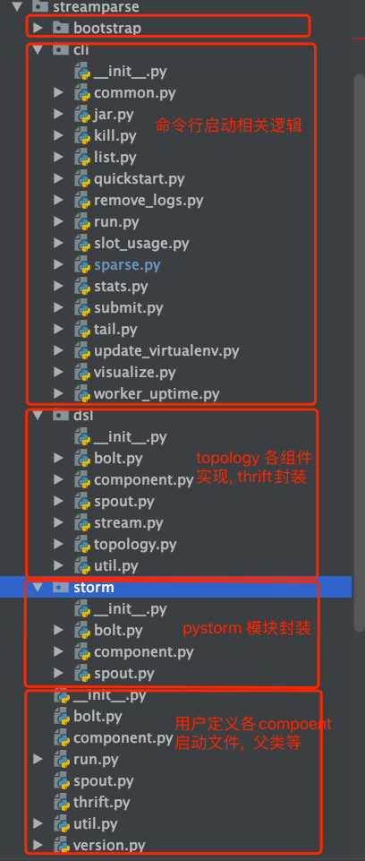
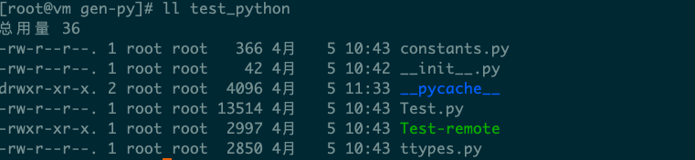
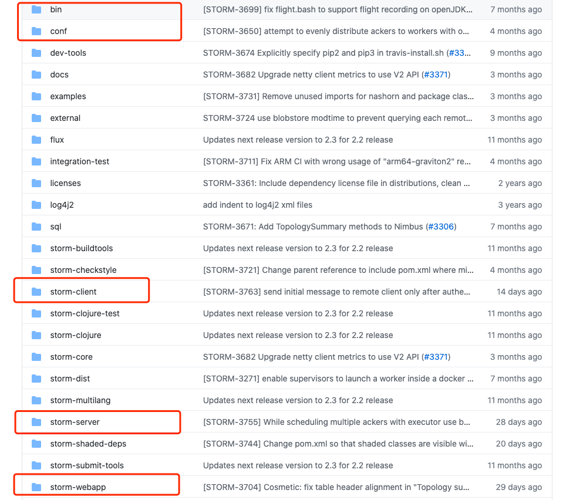

- [1. streamparse源码简述](#1-streamparse源码简述)
  - [1.1 代码结构](#11-代码结构)
    - [1.2 流程图](#12-流程图)
      - [1.2.1动态载入各模块](#121动态载入各模块)
      - [1.2.2 参数](#122-参数)
      - [1.2.3 查找topology文件](#123-查找topology文件)
      - [1.2.4 获取storm workers](#124-获取storm-workers)
- [2. thrift](#2-thrift)
  - [2.1 thrift介绍](#21-thrift介绍)
  - [2.2thrift使用示例:](#22thrift使用示例)
  - [2.3 更简洁的python api](#23-更简洁的python-api)
- [3. storm worker源码](#3-storm-worker源码)
  - [3.1 代码结构](#31-代码结构)
  - [3.2 流程图](#32-流程图)
  - [3.3 源码片段](#33-源码片段)
    - [3.3.1 spout, bolt主循环](#331-spout-bolt主循环)
    - [3.3.2 FieldsGroup计算](#332-fieldsgroup计算)
    - [3.3.3 ack机制](#333-ack机制)

# 1. streamparse源码简述
## 1.1 代码结构

### 1.2 流程图
https://www.processon.com/view/link/6077ffdde401fd2d669c76dc

#### 1.2.1动态载入各模块
```python
def load_subparsers(subparsers):
    """
    searches modules in streamparse/bin for a 'subparser_hook' method and calls
    the 'subparser_hook' method on the sparse subparsers object.
    """
    for _, mod_name, is_pkg in pkgutil.iter_modules([os.path.dirname(__file__)]):
        if not is_pkg and mod_name not in sys.modules:
            module = importlib.import_module(f"streamparse.cli.{mod_name}")
            # check for the subparser hook
            if hasattr(module, "subparser_hook"):
                module.subparser_hook(subparsers)
```
pkgutil使用:
```python
import pkgutil
import sys
import os
from os.path import dirname
import importlib


TEST_DIR = dirname(dirname(dirname(__file__))) + '/streamparse/streamparse'


def test1():
    for finder, mod_name, is_pkg in pkgutil.iter_modules([TEST_DIR]):
        print(finder, mod_name, is_pkg)  # finder对象, 模块名, 是否为package
        print(finder.find_spec(mod_name))
        print()
        if not is_pkg and mod_name not in sys.modules:
            module = importlib.import_module(f"streamparse.{mod_name}") 

def test2():
    for root, dirnames, filenames in os.walk(TEST_DIR):
        print(root, dirnames, filenames)  # 目录路径, 目录下子目录名, 目录下文件名
        if root == TEST_DIR:
            for name in filenames:
                if name == '__init__.py':
                    continue
                mod_name = name.split('.')[0]
                module = importlib.import_module(f"streamparse.{mod_name}") 


test1()

"""
FileFinder('/Users/liuyuan/projects/streamparse/streamparse') spout False
ModuleSpec(name='spout', loader=<_frozen_importlib_external.SourceFileLoader object at 0x7fac26c39c90>, origin='/Users/liuyuan/projects/streamparse/streamparse/spout.py')

FileFinder('/Users/liuyuan/projects/streamparse/streamparse') storm True
ModuleSpec(name='storm', loader=<_frozen_importlib_external.SourceFileLoader object at 0x7fac26bd8490>, origin='/Users/liuyuan/projects/streamparse/streamparse/storm/__init__.py', submodule_search_locations=['/Users/liuyuan/projects/streamparse/streamparse/storm'])

FileFinder('/Users/liuyuan/projects/streamparse/streamparse') thrift False
ModuleSpec(name='thrift', loader=<_frozen_importlib_external.SourceFileLoader object at 0x7fac26bd8490>, origin='/Users/liuyuan/projects/streamparse/streamparse/thrift.py')
"""


test2()


"""
/Users/liuyuan/projects/streamparse/streamparse ['bootstrap', 'cli', 'storm', 'dsl'] ['run.py', 'version.py', 'util.py', 'bolt.py', '__init__.py', 'thrift.py', 'spout.py', 'component.py']
/Users/liuyuan/projects/streamparse/streamparse/bootstrap ['project'] ['__init__.py']
/Users/liuyuan/projects/streamparse/streamparse/bootstrap/project ['virtualenvs', 'topologies', 'src'] ['project.jinja2.clj', 'config.jinja2.json', 'gitignore', 'fabfile.py']
"""
```

#### 1.2.2 参数
|参数名|含义|
|:---:|:---:|
|-a --ackers|acker的数量
|--config|指定配置文件
|-d --debug| 设置topology.debug为true
|-e --environment|选择配置文件中的运行环境
|-f --force|强制submit,如果存在同名的topo会kill
|-i --inactive|设置topology为inactive模式
|-j --local_jar_path|指定jar的路径
|-n --name|指定topo的name
|-o --option|传递到storm的参数或自定义参数<br>-o storm.workers.list<br>-o install_virtualenv
|-N --override_name|自定义topology名称
|--overwrite_virtualenv|重新创建虚拟环境就算已存在
|--pool_size|更新虚拟环境时创建ssh连接的个数
|-r --requirements|指定虚拟环境的安装文件
|-R --remote_jar_path|指定nimbus上的jar路径
|--timeout|指定submit的超时时间
|-u --uber_jar|submit时创建uber jar
|--user|创建或更新虚拟环境时的用户
|--wait|kill时的等待时间
|-w --workers|worker的数量

#### 1.2.3 查找topology文件
```python
topology_path = config["topology_specs"]
topology_files = glob(f"{topology_path}/*.py")
```

glob函数的使用:
```python
from glob import glob


TEST_DIR = '/Users/liuyuan/projects/streamparse/streamparse/'

# glob用于查找匹配某个路径下的文件
files = glob(TEST_DIR + '*.py')
print(files)

"""
['/Users/liuyuan/projects/streamparse/streamparse/run.py', '/Users/liuyuan/projects/streamparse/streamparse/version.py', '/Users/liuyuan/projects/streamparse/streamparse/util.py', '/Users/liuyuan/projects/streamparse/streamparse/bolt.py', '/Users/liuyuan/projects/streamparse/streamparse/__init__.py', '/Users/liuyuan/projects/streamparse/streamparse/thrift.py', '/Users/liuyuan/projects/streamparse/streamparse/spout.py', '/Users/liuyuan/projects/streamparse/streamparse/component.py']
"""

# 匹配所有文件, 目录, 只匹配第一层, recursive=True会递归输出所有子目录
files2 = glob(TEST_DIR + '**')
print(files2)
```

#### 1.2.4 获取storm workers
```python
_storm_workers = {}

def get_storm_workers(env_config):
    """Retrieves list of workers, optionally from nimbus.

    This function will look up the list of current workers from nimbus if
    workers have not been defined in config.json.

    :param env_config: The project's parsed config.
    :type env_config: `dict`

    :returns: List of workers
    """
    nimbus_info = get_nimbus_host_port(env_config)
    if nimbus_info in _storm_workers:
        return _storm_workers[nimbus_info]

    worker_list = env_config.get("workers")
    if not worker_list:
        with ssh_tunnel(env_config) as (host, port):  # context manager
            nimbus_client = get_nimbus_client(env_config, host=host, port=port)
            cluster_info = nimbus_client.getClusterInfo()
            worker_list = [supervisor.host for supervisor in cluster_info.supervisors]

    _storm_workers[nimbus_info] = worker_list
    return worker_list


@contextmanager
def ssh_tunnel(env_config, local_port=6627, remote_port=None, quiet=False):
    """Setup an optional ssh_tunnel to Nimbus.

    If use_ssh_for_nimbus is False, no tunnel will be created.
    """
    host, nimbus_port = get_nimbus_host_port(env_config)
 
    if is_ssh_for_nimbus(env_config):
        """
        创建ssh 连接
        ........
        """
        yield "localhost", local_port
        # Clean up after we exit context
        if need_setup:
            ssh_proc.kill()
        del _active_tunnels[local_port]
    # Do nothing if we're not supposed to use ssh
    else:
        yield host, remote_port

```
contextlib使用:
```python
from contextlib import contextmanager

@contextmanager
def tag(name):
    try:
        print("start...")

        yield name

        print("end...")
    finally:
        print('finished..')


with tag("aaa") as n:
    print("hello world")
    raise Exception('something wrong')
    print(n)


"""
start...
hello world
finished..
Traceback (most recent call last):
  File "/Users/liuyuan/projects/apache-storm/tests/test_contextlib.py", line 18, in <module>
    raise Exception('something wrong')
Exception: something wrong
"""
```
# 2. thrift
## 2.1 thrift介绍
在storm中nimbus, supervisor都属于thrift server;

Thrift是一个远程过程调用（RPC）框架，可实现跨语言的调用, 目前是Apache软件基金会的开源项目;

用户通过Thrift的IDL（接口定义语言）来描述接口函数及数据类型，然后通过Thrift的编译环境生成各种语言类型的接口文件，用户可以根据自己的需要采用不同的语言开发客户端代码和服务器端代码。

## 2.2thrift使用示例:

(1) 定义thrift文件(test_thrift.thrift):
```thrift
# 定义namespace
namespace py test_python
namespace java test_java


# 定义数据类型
struct People {
    1: string name,
    2: i32 age
}

# 定义service
service Test {
    void print_people_info(1:People people),

    i32 add(1:i32 number1, 2:i32 number2)
}

```
(2) 编译thrift文件
```bash
# thrift --gen language thrift_file
thrift --gen py test_thrift.thrift
# 或者
thrift --gen java test_thrift.thrift
```
生成的文件目录:



Test.py: 按Service生成的对应文件

ttypes.py: 按数据类型生成的对应文件

constants.py: 集中导入一些类名;

Test-remote: 用于测试service的文件;

(3) 利用自动生成的代码编写server或client代码

server:
```python
from test_python import Test

from thrift.transport import TSocket
from thrift.transport import TTransport
from thrift.protocol import TBinaryProtocol
from thrift.server import TServer


class FunctionHandler:

    # 定义同名函数
    def print_people_info(self, people):
        print(people.name, people.age)

    def add(self, number1, number2):
        return number1 + number2


if __name__ == '__main__':
    # handler封装入Test中
    hander = FunctionHandler()
    processor = Test.Processor(hander)

    # 创建socket和server
    transport = TSocket.TServerSocket(host='127.0.0.1', port=9090)
    tfactory = TTransport.TBufferedTransportFactory()
    pfactory = TBinaryProtocol.TBinaryProtocolFactory()

    server = TServer.TSimpleServer(processor, transport, tfactory, pfactory)

    # 启动server
    print('server started...')
    server.serve()
```

client:
```python
from test_python import Test
from test_python.ttypes import People

from thrift import Thrift
from thrift.transport import TSocket
from thrift.transport import TTransport
from thrift.protocol import TBinaryProtocol


def main():
    # Make socket
    transport = TSocket.TSocket('localhost', 9090)

    # Buffering is critical. Raw sockets are very slow
    transport = TTransport.TBufferedTransport(transport)

    # Wrap in a protocol
    protocol = TBinaryProtocol.TBinaryProtocol(transport)

    # Create a client to use the protocol
    client = Test.Client(protocol)

    # Make peple instane
    people = People(name='Alice', age=15)

    # Connect
    transport.open()

    # execute
    client.print_people_info(people)
    print('print people info success.')

    res = client.add(2, 3)
    print('add result: %s + %s=%s' % (2, 3, res))

    # Close
    transport.close()


main()
```

## 2.3 更简洁的python api
server:
```python
import thriftpy2

# 解析thrift文件
test_python = thriftpy2.load('test_thrift.thrift', module_name='test_python_thrift')

from thriftpy2.rpc import make_server


class FunctionHandler:

    # 定义同名函数
    def print_people_info(self, people):
        print(people.name, people.age)

    def add(self, number1, number2):
        return number1 + number2

server = make_server(test_python.Test, FunctionHandler(), 'localhost', 9090)
print('server started...')
server.serve()
```

client:
```python
import thriftpy2

# 解析thrift文件
test_python = thriftpy2.load('test_thrift.thrift', module_name='test_python_thrift')

from thriftpy2.rpc import make_client

# 创建client
client = make_client(test_python.Test, 'localhost', 9090)

people = test_python.People(name='Alice', age=25)

# execute
client.print_people_info(people)
print('print people info success.')

res = client.add(2, 3)
print('add result: %s + %s=%s' % (2, 3, res))

```
# 3. storm worker源码
## 3.1 代码结构
版本2.0.0以前, 大部分代码都由clojure所写, 不易阅读与维护

最新版本:

bin/: 程序入口, 命令行启动storm服务(python脚本)

storm-client: worker, executor, spout, bolt等实现;

storm-server: nimbus, supervisor等实现;

storm-webapp: ui server等实现;

## 3.2 流程图
https://www.processon.com/view/link/6077ffdde401fd2d669c76dc

## 3.3 源码片段
### 3.3.1 spout, bolt主循环
(1) 外层循环:
```java
  public static SmartThread asyncLoop(final Callable afn, boolean isDaemon, final Thread.UncaughtExceptionHandler eh,
                                        int priority, final boolean isFactory, boolean startImmediately,
                                        String threadName) {
        SmartThread thread = new SmartThread(new Runnable() {
            public void run() {
                try {
                    final Callable<Long> fn = isFactory ? (Callable<Long>) afn.call() : afn;
                    while (true) {
                        if (Thread.interrupted()) {
                            throw new InterruptedException();
                        }
                        final Long s = fn.call();
                        if (s == null) { // then stop running it
                            break;
                        }
                        if (s > 0) {
                            Time.sleep(s);
                        }
                    }
                } catch (Throwable t) {
                    if (Utils.exceptionCauseIsInstanceOf(
                        InterruptedException.class, t)) {
                        LOG.info("Async loop interrupted!");
                        return;
                    }
                    LOG.error("Async loop died!", t);
                    throw new RuntimeException(t);
                }
            }
        });
        if (eh != null) {
            thread.setUncaughtExceptionHandler(eh);
        } else {
            thread.setUncaughtExceptionHandler(new Thread.UncaughtExceptionHandler() {
                public void uncaughtException(Thread t, Throwable e) {
                    LOG.error("Async loop died!", e);
                    Utils.exitProcess(1, "Async loop died!");
                }
            });
        }
        thread.setDaemon(isDaemon);
        thread.setPriority(priority);
        if (threadName != null && !threadName.isEmpty()) {
            thread.setName(thread.getName() + "-" + threadName);
        }
        if (startImmediately) {
            thread.start();
        }
        return thread;
}
```
(2) spout主循环
```java
public Callable<Long> call() throws Exception {
        init(idToTask, idToTaskBase);
        return new Callable<Long>() {
            final int recvqCheckSkipCountMax = getSpoutRecvqCheckSkipCount();
            int recvqCheckSkips = 0;
            int swIdleCount = 0; // counter for spout wait strategy
            int bpIdleCount = 0; // counter for back pressure wait strategy
            int rmspCount = 0;

            @Override
            public Long call() throws Exception {
                int receiveCount = 0;
                receiveCount = receiveQueue.consume(SpoutExecutor.this);

                long currCount = emittedCount.get();
                boolean reachedMaxSpoutPending = (maxSpoutPending != 0) && (pending.size() >= maxSpoutPending); //spout pending

                boolean pendingEmitsIsEmpty = tryFlushPendingEmits();
                boolean noEmits = true;
                long emptyStretch = 0;

                if (!reachedMaxSpoutPending && pendingEmitsIsEmpty) {
                    for (int j = 0; j < spouts.size(); j++) {
                        spouts.get(j).nextTuple();
                    }
                    noEmits = (currCount == emittedCount.get());
                    if (noEmits) {
                        emptyEmitStreak.increment();
                    } else {
                        emptyStretch = emptyEmitStreak.get();
                        emptyEmitStreak.set(0);
                    }
                }
                if (reachedMaxSpoutPending) {
                    if (rmspCount == 0) {
                        LOG.debug("Reached max spout pending");
                    }
                    rmspCount++;
                } else {
                    if (rmspCount > 0) {
                        LOG.debug("Ended max spout pending stretch of {} iterations", rmspCount);
                    }
                    rmspCount = 0;
                }

                if (receiveCount > 1) {
                    // continue without idling
                    return 0L;
                }
                if (!pendingEmits.isEmpty()) { // then facing backpressure
                    backPressureWaitStrategy();
                    return 0L;
                }
                bpIdleCount = 0;
                if (noEmits) {
                    spoutWaitStrategy(reachedMaxSpoutPending, emptyStretch);  // 如果没有emit, spout等待
                    return 0L;
                }
                swIdleCount = 0;
                return 0L;
            }

            private void backPressureWaitStrategy() throws InterruptedException {
                long start = Time.currentTimeMillis();
                bpIdleCount = backPressureWaitStrategy.idle(bpIdleCount);
            }

            private void spoutWaitStrategy(boolean reachedMaxSpoutPending, long emptyStretch) throws InterruptedException {
                emptyEmitStreak.increment();
                long start = Time.currentTimeMillis();
                swIdleCount = spoutWaitStrategy.idle(swIdleCount);
            }
```
(3) bolt主循环
```java
 public Callable<Long> call() throws Exception {
        init(idToTask, idToTaskBase);

        return new Callable<Long>() {
            int bpIdleCount = 0;
            int consumeIdleCounter = 0;
            private final ExitCondition tillNoPendingEmits = () -> pendingEmits.isEmpty();

            @Override
            public Long call() throws Exception {
                updateExecCredsIfRequired();
                boolean pendingEmitsIsEmpty = tryFlushPendingEmits();
                if (pendingEmitsIsEmpty) {
                    if (bpIdleCount != 0) {
                        LOG.debug("Ending Back Pressure Wait stretch : {}", bpIdleCount);
                    }
                    bpIdleCount = 0;
                    int consumeCount = receiveQueue.consume(BoltExecutor.this, tillNoPendingEmits);
                    if (consumeCount == 0) {
                        if (consumeIdleCounter == 0) {
                            LOG.debug("Invoking consume wait strategy");
                        }
                        consumeIdleCounter = consumeWaitStrategy.idle(consumeIdleCounter);
                        if (Thread.interrupted()) {
                            throw new InterruptedException();
                        }
                    } else {
                        if (consumeIdleCounter != 0) {
                            LOG.debug("Ending consume wait stretch : {}", consumeIdleCounter);
                        }
                        consumeIdleCounter = 0;
                    }
                } else {
                    if (bpIdleCount == 0) { // check avoids multiple log msgs when spinning in a idle loop
                        LOG.debug("Experiencing Back Pressure. Entering BackPressure Wait. PendingEmits = {}", pendingEmits.size());
                    }
                    bpIdleCount = backPressureWaitStrategy.idle(bpIdleCount);
                }

                return 0L;
            }
```

### 3.3.2 FieldsGroup计算
```java
public static int deepHashCode(Object a[]) {
        if (a == null)
            return 0;

        int result = 1;

        for (Object element : a) {
            int elementHash = 0;
            if (element instanceof Object[])
                elementHash = deepHashCode((Object[]) element);
            else if (element instanceof byte[])
                elementHash = hashCode((byte[]) element);
            else if (element instanceof short[])
                elementHash = hashCode((short[]) element);
            else if (element instanceof int[])
                elementHash = hashCode((int[]) element);
            else if (element instanceof long[])
                elementHash = hashCode((long[]) element);
            else if (element instanceof char[])
                elementHash = hashCode((char[]) element);
            else if (element instanceof float[])
                elementHash = hashCode((float[]) element);
            else if (element instanceof double[])
                elementHash = hashCode((double[]) element);
            else if (element instanceof boolean[])
                elementHash = hashCode((boolean[]) element);
            else if (element != null)
                elementHash = element.hashCode();

            result = 31 * result + elementHash;
        }

        return result;
    }
```
### 3.3.3 ack机制
```java
package org.apache.storm.daemon;

public void execute(Tuple input) {
        if (TupleUtils.isTick(input)) {
            Map<Object, AckObject> tmp = pending.rotate();
            LOG.debug("Number of timeout tuples:{}", tmp.size());
            return;
        }

        boolean resetTimeout = false;
        String streamId = input.getSourceStreamId();
        Object id = input.getValue(0);
        AckObject curr = pending.get(id);
        if (ACKER_INIT_STREAM_ID.equals(streamId)) {
            if (curr == null) {
                curr = new AckObject();
                pending.put(id, curr);
            }
            curr.updateAck(input.getLong(1));
            curr.spoutTask = input.getInteger(2);
        } else if (ACKER_ACK_STREAM_ID.equals(streamId)) {
            if (curr == null) {
                curr = new AckObject();
                pending.put(id, curr);
            }
            curr.updateAck(input.getLong(1));
        } else if (ACKER_FAIL_STREAM_ID.equals(streamId)) {
            // For the case that ack_fail message arrives before ack_init
            if (curr == null) {
                curr = new AckObject();
            }
            curr.failed = true;
            pending.put(id, curr);
        } else if (ACKER_RESET_TIMEOUT_STREAM_ID.equals(streamId)) {
            resetTimeout = true;
            if (curr == null) {
                curr = new AckObject();
            }
            pending.put(id, curr);
        } else if (Constants.SYSTEM_FLUSH_STREAM_ID.equals(streamId)) {
            collector.flush();
            return;
        } else {
            LOG.warn("Unknown source stream {} from task-{}", streamId, input.getSourceTask());
            return;
        }

        int task = curr.spoutTask;
        if (task >= 0 && (curr.val == 0 || curr.failed || resetTimeout)) {
            Values tuple = new Values(id, getTimeDeltaMillis(curr.startTime));
            if (curr.val == 0) {
                pending.remove(id);
                collector.emitDirect(task, ACKER_ACK_STREAM_ID, tuple);
            } else if (curr.failed) {
                pending.remove(id);
                collector.emitDirect(task, ACKER_FAIL_STREAM_ID, tuple);
            } else if (resetTimeout) {
                collector.emitDirect(task, ACKER_RESET_TIMEOUT_STREAM_ID, tuple);
            } else {
                throw new IllegalStateException("The checks are inconsistent we reach what should be unreachable code.");
            }
        }

        collector.ack(input);
    }

private static class AckObject {
        public long val = 0L;
        public long startTime = Time.currentTimeMillis();
        public int spoutTask = -1;
        public boolean failed = false;

        // val xor value
        public void updateAck(Long value) {
            val = Utils.bitXor(val, value);
        }
    }
```